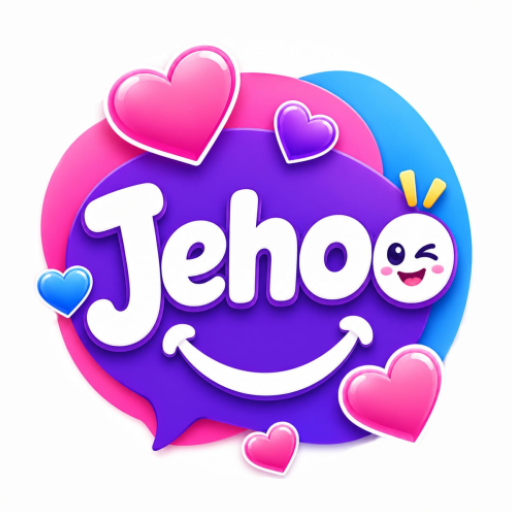

<div align="center">



# JEHO CHAT
### صوت · دراما · دردشة · Voice · Drama · Chat

[](#)
[](#)
[](#)
[-EC4899?style=for-the-badge)](#)
[](#)
[](#)

**EN:** Voice party rooms · short drama · chat · games · gifts · VIP — one neon social universe.  
**AR:** غرف صوتية · دراما قصيرة · دردشة · ألعاب · هدايا · VIP — عالم اجتماعي نيون في تطبيق واحد.

<br/>

| 🎤 Voice | 🎬 Drama | 💬 Chat | 🎮 Games |
|:--------:|:--------:|:-------:|:--------:|
| Party Rooms | Short Episodes | Private · Social | Party Fun |

</div>

---

## 📱 Screenshots · لقطات الشاشة

<p align="center">
  
  &nbsp;
  
  &nbsp;
  
  &nbsp;
  
  &nbsp;
  
  &nbsp;
  
</p>

| Screen | EN | AR |
|--------|----|----|
| Live | Live streaming & party energy | بث مباشر وأجواء الحفل |
| Voice Rooms | Host seats · co-hosts · gifts | غرف صوتية · مقاعد · هدايا |
| Chat | Fast private & social chat | دردشة سريعة وخاصة |
| Video Calls | High-quality video calls | مكالمات فيديو عالية الجودة |
| Gifts · VIP | Effects · levels · VIP style | هدايا · مستويات · VIP |
| Short Drama | Bite-sized mobile dramas | دراما قصيرة للموبايل |

> Store-ready assets also in `JEHO-CHAT-Release/screenshots/` and brand icons in `Icons/`.

---

## 📌 Overview · نظرة عامة

<table>
<tr>
<td width="50%" valign="top">

### 🇬🇧 English
**JEHO CHAT** is a neon social Android app.

- Voice party rooms (ZEGOCLOUD)
- Built-in short drama binge zone
- Chat, gifts, VIP & levels
- Party games & live vibes
- NestJS backend · PostgreSQL · Redis
- Admin dashboard (Vue 3)

</td>
<td width="50%" valign="top">

### 🇸🇦 العربية
**JEHO CHAT** تطبيق أندرويد اجتماعي بتصميم نيون.

- غرف حفلات صوتية (ZEGOCLOUD)
- منطقة دراما قصيرة مدمجة
- دردشة، هدايا، VIP ومستويات
- ألعاب حفلات وأجواء لايف
- باك اند NestJS · PostgreSQL · Redis
- لوحة إدارة Vue 3

</td>
</tr>
</table>

---

## ✨ Features · المميزات

```text
┌──────────────────┬──────────────────┬──────────────────┐
│  🎤  Voice       │  🎬  Drama       │  💬  Chat        │
│  Rooms · Seats   │  Short Episodes  │  Private · Social│
├──────────────────┼──────────────────┼──────────────────┤
│  🎁  Gifts       │  👑  VIP         │  🎮  Games       │
│  Effects · Send  │  Levels · Style  │  Party Fun       │
└──────────────────┴──────────────────┴──────────────────┘
```

| Feature | EN | AR |
|--------|----|----|
| Voice rooms | Host / join glowing audio parties | استضف أو انضم لغرف صوتية |
| Short drama | Romance · suspense · binge episodes | حلقات قصيرة مشوّقة |
| Social | Chat · profile · relations | دردشة · ملف · علاقات |
| Monetization | Gifts · VIP · wallet | هدايا · VIP · محفظة |

---

## 🛠️ Tech Stack · التقنيات

<p align="center">
  
  
  
  
  
  
</p>

| Layer | Stack |
|-------|--------|
| Android | Java · Clean Architecture · Material 3 |
| Realtime / Voice | ZEGOCLOUD Express · Socket.io |
| Backend | NestJS · PostgreSQL · Redis · JWT |
| Dashboard | Vue 3 · Vite · Bootstrap 5 · Chart.js |
| Brand | Neon Magenta / Electric Blue |

---

## 📁 Project Structure · هيكل المشروع

```text
JEHO-CHAT/
├── android/                 # Google Play client (com.Dramizo.Series)
├── backend/                 # NestJS API + realtime + ZEGO tokens
├── database/                # schema.sql
├── docs/                    # Docs + README brand/screenshots
│   ├── brand/logo.png
│   └── screenshots/         # Gallery for GitHub README
├── Icons/                   # Full-res brand icons
├── JEHO-CHAT-Release/       # Store icon · feature graphic · screenshots
├── store/                   # Play listing AR/EN
├── deploy/ · scripts/       # Deploy helpers
└── README.md
```

---

## 🚀 Build & Run · البناء والتشغيل

### Requirements
- JDK · Android SDK · **minSdk 24** · **targetSdk 36**
- Node.js · PostgreSQL · Redis (backend / dashboard)

### Android
```bash
cd android
./gradlew.bat assembleDebug
# or open android/ in Android Studio
```

### Backend + Dashboard (Windows)
```powershell
cd scripts
.\start-local.ps1
```

More: [docs/INSTALLATION.md](docs/INSTALLATION.md) · [docs/DEPLOYMENT.md](docs/DEPLOYMENT.md) · [docs/ZEGO.md](docs/ZEGO.md)

---

## 📦 App Identity · هوية التطبيق

| Key | Value |
|-----|-------|
| App name | **JEHO CHAT** |
| Play title | JEHO CHAT: Voice & Drama |
| Application ID | `com.Dramizo.Series` |
| Version | `2.0.39` (32) |
| Min / Target SDK | **24** / **36** |
| Support | `sf213777@gmail.com` |
| Privacy | https://api.adnova.bbs.tr/privacy.html |

---

## 🎨 Brand Assets · أصول العلامة

| Path | Content |
|------|---------|
| `docs/brand/logo.png` | README logo |
| `Icons/logo.png` | Full brand logo |
| `Icons/*_icon.png` | Chats · Rooms · Live · Drama · Games · Profile |
| `JEHO-CHAT-Release/` | Play icon 512 · feature graphic · screenshots |
| `store/JEHO-CHAT-Play/` | Listing AR / EN |

---

## 📜 License · الرخصة

**Private / Proprietary** — All rights reserved.  
خاص — جميع الحقوق محفوظة. Keep this repository **Private**.

---

<div align="center">


**JEHO CHAT** · Voice · Drama · Chat  
`com.Dramizo.Series` · `v2.0.39 (32)` · API 24+

Live. Connect. Glow.

</div>
