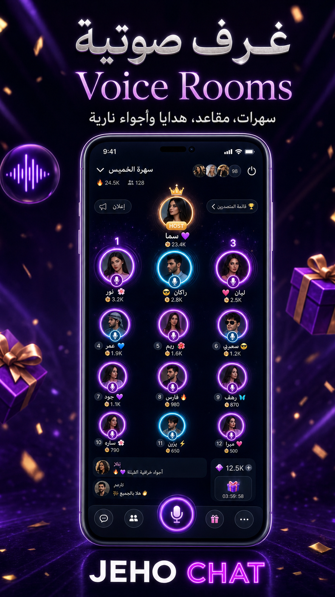
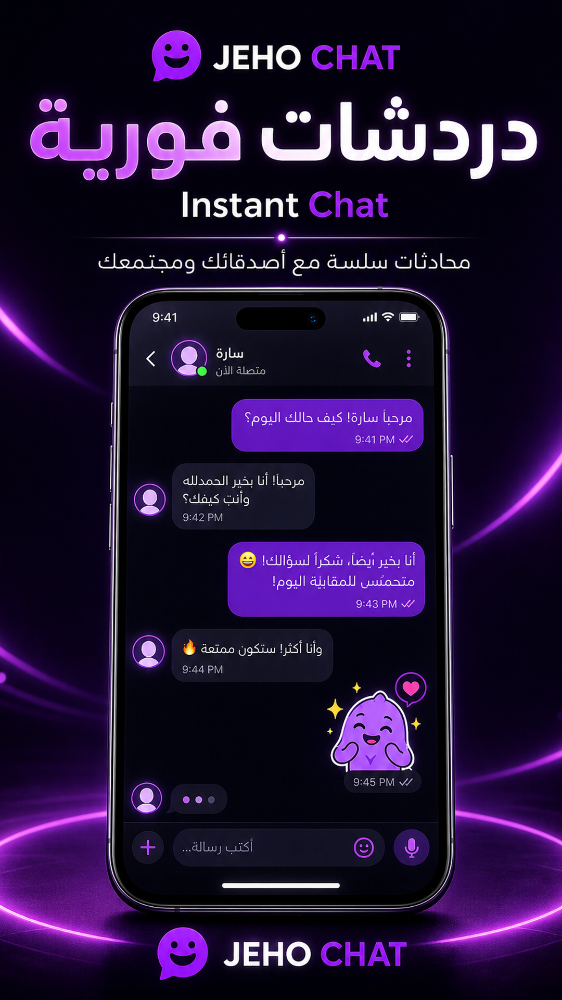

<div align="center">


# JEHO CHAT

### غرف صوتية · دراما · دردشة · هدايا · VIP  
### Voice Rooms · Short Drama · Chat · Gifts · VIP

[](android/)
[-0F7A4D?style=for-the-badge)](android/app/build.gradle)
[](android/)
[](https://api.adnova.bbs.tr)
[](#-license--الرخصة)

**تطبيق اجتماعي جاهز للإنتاج** — أندرويد + NestJS + PostgreSQL + Redis + لوحة إدارة Vue.  
المنصة مضبوطة ومربوطة: الغرف الصوتية، الاقتصاد، الوكالات، التارجت/الرواتب، الشحن، وملف سياسة PDF.

<br/>

| 🎤 Voice | 🎬 Drama | 💬 Chat | 🎁 Gifts | 👑 VIP |
|:--------:|:--------:|:-------:|:--------:|:------:|
| Party rooms | Short episodes | Private · Social | Effects · Wallet | Levels · Style |

</div>

---

## حالة النظام · System status

| المكوّن | الحالة | ملاحظة |
|--------|--------|--------|
| تطبيق أندرويد | ✅ مضبوط | `com.Dramizo.Series` · `v2.0.43` (35) · targetSdk 36 |
| الـ API | ✅ على السيرفر | NestJS + PM2 (`auralive-api`) |
| قاعدة البيانات | ✅ | PostgreSQL + Redis |
| لوحة الإدارة | ✅ | Vue 3 على `/admin` |
| الغرف الصوتية | ✅ | ZEGOCLOUD Express |
| اقتصاد / هدايا / وكالات | ✅ | نسب قابلة للتعديل من الداشبورد |
| تارجت المضيف + الرواتب | ✅ | جدول ٣٤ مرحلة (كوين = ألماسة) |
| سياسة المنصة PDF | ✅ | تنزيل عربي مباشر من الأدمن |
| نشر تدريجي | ✅ | `scripts/deploy_incremental.py` |

> التفاصيل التشغيلية ونشر السيرفر: **[docs/SERVER_INSTALL.md](docs/SERVER_INSTALL.md)**

---

## لقطات الشاشة · Screenshots

<p align="center">
  
  &nbsp;
  
  &nbsp;
  
  &nbsp;
  
  &nbsp;
  
  &nbsp;
  
</p>

---

## نظرة عامة · Overview

<table>
<tr>
<td width="50%" valign="top">

### العربية
**JEHO CHAT** عالم اجتماعي صوتي على أندرويد:

- غرف حفلات صوتية بمقاعد وهدايا مباشرة
- دراما قصيرة داخل التطبيق
- دردشة خاصة واجتماعية
- محفظة · شحن · وكلاء شحن
- وكالات مضيفات + تارجت شهري ورواتب بالدولار
- لوحة إدارة كاملة للأسعار والسياسات وملف PDF

</td>
<td width="50%" valign="top">

### English
**JEHO CHAT** is a production voice-social Android product:

- Voice party rooms with seats & live gifts
- Built-in short drama
- Private & social chat
- Wallet · recharge · recharge agents
- Host agencies + monthly target salary ladder
- Full admin console (pricing, policy PDF, ops)

</td>
</tr>
</table>

---

## المميزات · Features

| Feature | AR | EN |
|---------|----|----|
| Voice rooms | استضافة وانضمام لغرف صوتية | Host / join glowing audio parties |
| Gifts & effects | هدايا كاملة الشاشة + أصوات | Full-screen gifts & sounds |
| Agencies | وكالات · نسب تقسيم · دعوات | Agencies · gift split · invites |
| Host target | ٣٤ مرحلة · راتب مضيف/وكيل | 34-stage host/agent USD ladder |
| VIP & cosmetics | عضوية · إطارات · دخولية | VIP · frames · entry effects |
| Drama | حلقات قصيرة للموبايل | Bite-sized mobile dramas |
| Admin PDF | سياسة المنصة بتنزيل عربي | Arabic policy PDF download |
| Customer support room | غرفة خدمة عملاء مثبتة | Pinned support room |

---

## التقنيات · Tech stack

| الطبقة | التقنيات |
|--------|----------|
| Android | Java · Clean Architecture · Material · ZEGOCLOUD |
| Backend | NestJS · TypeORM · PostgreSQL · Redis · Socket.io · JWT |
| Dashboard | Vue 3 · Vite · Bootstrap 5 · Chart.js · pdfmake |
| Deploy | Python incremental upload · remote `nest build` · PM2 |
| Brand | لوجو رسمي في `docs/brand/logo.png` |

---

## هيكل المشروع · Structure

```text
JEHO-CHAT/
├── android/                      # تطبيق Google Play (com.Dramizo.Series)
├── backend/                      # NestJS API + realtime + uploads
│   ├── dashboard/                # لوحة الإدارة (Vue) → تُبنى إلى /admin
│   ├── public/                   # أصول عامة + visual-system
│   └── src/                      # وحدات الـ API
├── database/
│   ├── schema.sql                # مخطط محدّث من السيرفر
│   ├── auralive_prod_*.sql       # نسخة كاملة من إنتاج PostgreSQL
│   └── README.md
├── docs/
│   ├── brand/logo.png            # اللوجو الحقيقي (README)
│   ├── brand/jeho_logo.png
│   ├── screenshots/              # لقطات المتجر
│   └── SERVER_INSTALL.md         # تثبيت ونشر السيرفر
├── scripts/
│   ├── deploy_incremental.py     # نشر تدريجي للإنتاج
│   ├── pull_prod_database.py     # سحب قاعدة البيانات من السيرفر
│   └── deploy.local.env.example  # قالب بيانات السيرفر (بدون أسرار)
├── JEHO-CHAT-Release/            # أيقونة المتجر + feature graphic
└── README.md
```

---

## التشغيل المحلي · Local run

### المتطلبات
- JDK + Android SDK (**minSdk 24** · **targetSdk 36**)
- Node.js 20+ · PostgreSQL · Redis

### أندرويد
```bash
cd android
./gradlew.bat assembleDebug
```

### الـ API + الداشبورد
```bash
cd backend
cp .env.example .env
# عدّل الأسرار و ZEGO وقاعدة البيانات
npm install
npm run start:dev

cd dashboard
npm install
npm run dev
```

### نشر الإنتاج
راجع الدليل الكامل: **[docs/SERVER_INSTALL.md](docs/SERVER_INSTALL.md)**

```bash
# مثال نشر تدريجي بعد تجهيز scripts/deploy.local.env
python scripts/deploy_incremental.py backend/src/modules/.../file.ts
python scripts/deploy_incremental.py backend/dashboard/src/views/SomeView.vue
```

---

## هوية التطبيق · App identity

| المفتاح | القيمة |
|---------|--------|
| الاسم | **JEHO CHAT** |
| عنوان المتجر | JEHO CHAT: Voice & Drama |
| Application ID | `com.Dramizo.Series` |
| الإصدار | `2.0.43` (versionCode **35**) |
| Min / Target SDK | **24** / **36** |
| API | `https://api.adnova.bbs.tr` |
| الأدمن | `https://api.adnova.bbs.tr/admin/` |
| الدعم | `sf213777@gmail.com` |
| الخصوصية | https://api.adnova.bbs.tr/privacy.html |

---

## أصول العلامة · Brand assets

| المسار | المحتوى |
|--------|---------|
| [`docs/brand/logo.png`](docs/brand/logo.png) | **اللوجو الرسمي** المستخدم في README والداشبورد |
| [`docs/brand/jeho_logo.png`](docs/brand/jeho_logo.png) | نسخة بديلة للعلامة |
| `backend/dashboard/src/assets/brand/` | مصدر لوجو لوحة الإدارة |
| `JEHO-CHAT-Release/app-icon-512.png` | أيقونة المتجر |
| `docs/screenshots/` | لقطات الشاشة الستة |

---

## الرخصة · License

**Private / Proprietary** — جميع الحقوق محفوظة.  
Keep this repository **Private**.

---

<div align="center">


**JEHO CHAT** · Voice · Drama · Chat  
`com.Dramizo.Series` · `v2.0.43 (35)` · Production-ready

Live. Connect. Earn.

</div>
